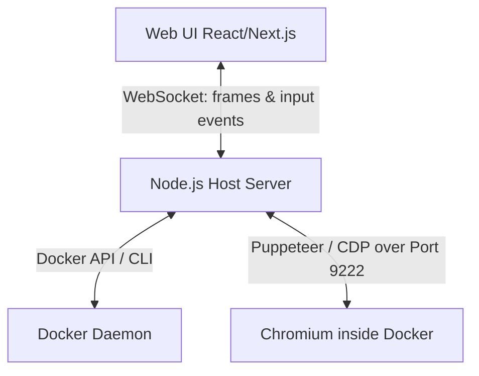

# Remote Browser Control System

A mini TeamViewer-like system for running and controlling a headless Chromium browser in a local Docker container from a React web interface.

## Proposed Architecture

1. **Docker Container**:
   - Runs a lightweight Chromium browser in headless mode with `--remote-debugging-port=9222` and `--remote-debugging-address=0.0.0.0`.
   - Exposes port `9222` to the host.
2. **Node.js Host Server**:
   - Manages Docker containers (starts/stops on demand via `docker run` or Dockerode).
   - Establishes a WebSocket server for the Web UI.
   - Connects to the Chromium instance inside the container using Puppeteer's `puppeteer.connect`.
   - Listens to Puppeteer page viewport changes and uses Chrome DevTools Protocol (CDP) `Page.startScreencast` to get high-frequency frame updates (JPEGs) and sends them to the Web UI via WebSockets.
   - Receives mouse clicks, moves, scrolls, and key presses from the Web UI and simulates them on the Puppeteer page.
3. **Web UI (React)**:
   - A modern, premium UI with "Start/Stop Browser", URL bar, back/forward buttons, and a viewport display.
   - Renders the incoming frame stream on an HTML5 `<canvas>` or `` tag.
   - Captures mouse events (clicks, movement, scrolling) and keyboard events, translating coordinates based on viewport size, and sending them back to the server over WebSockets.

## User Review Required

> [!IMPORTANT]
> The system requires Docker to be running locally on your machine. The Node.js server will communicate with the local Docker daemon.

## Open Questions

None at this stage. We will proceed with the VNC-less CDP stream architecture as it is cleaner, requires no heavy desktop environment in Docker, and provides direct automation control.

## Proposed Changes

### Docker
#### [NEW] [Dockerfile](file:///d:/BLD%20Assisgment/docker/Dockerfile)
Lightweight Alpine image with Chromium and required fonts, starting Chromium in headless debug mode.

### Backend
#### [NEW] [package.json](file:///d:/BLD%20Assisgment/backend/package.json)
Node.js dependencies: `express`, `ws`, `puppeteer-core`, `dockerode`.
#### [NEW] [server.js](file:///d:/BLD%20Assisgment/backend/server.js)
Express server + WS server to orchestrate Docker containers, connect Puppeteer, capture screencast, and proxy inputs.

### Frontend
#### [NEW] [package.json](file:///d:/BLD%20Assisgment/frontend/package.json)
Vite + React dependencies + styling.
#### [NEW] [src/App.jsx](file:///d:/BLD%20Assisgment/frontend/src/App.jsx)
Main React component with interactive control room UI.
#### [NEW] [src/index.css](file:///d:/BLD%20Assisgment/frontend/src/index.css)
Premium styles, dark mode, glowing accents, and layout.

## Verification Plan

### Manual Verification
1. Build the Docker image.
2. Run backend server.
3. Run frontend client.
4. Click "Start Browser" in UI, observe container creation.
5. Enter a URL (e.g., `https://news.ycombinator.com`), verify the page loads and streams frames.
6. Verify clicking links, typing into input boxes, and scrolling work.
